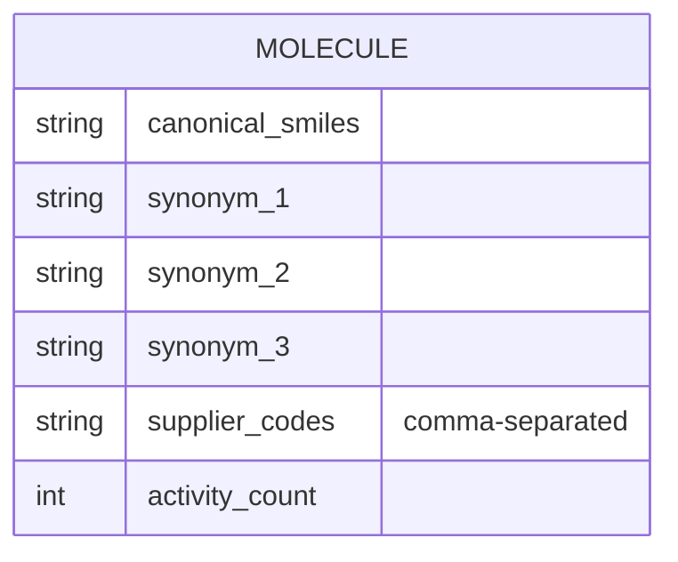
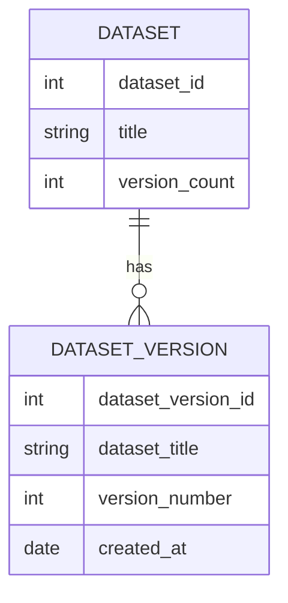
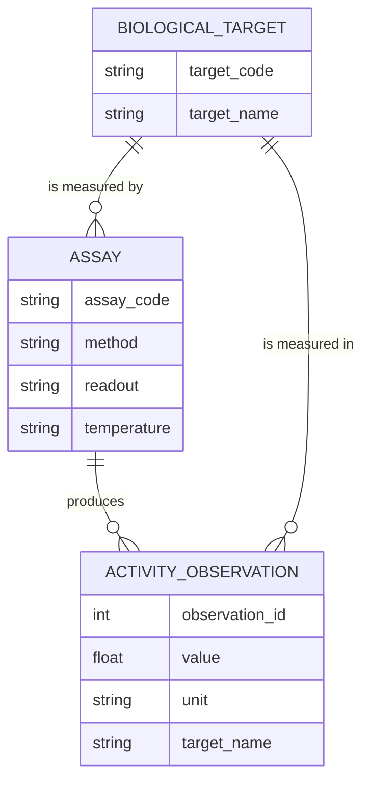
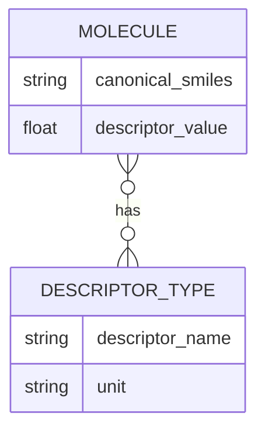
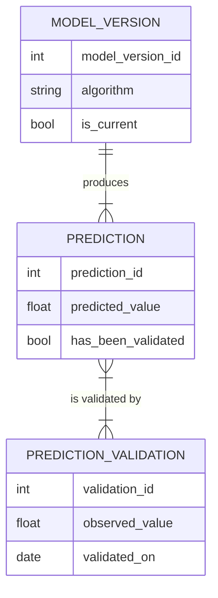

# Exercise 1 — Five broken ER fragments (Required)

Each fragment below is a real design mistake, written the way people actually
write them. For each one: name the defect, say what goes wrong in the data if it
ships, and write the repaired fragment as Mermaid `erDiagram` source.

Answer in the three cells under each fragment. Replace every `TODO`.

Defect vocabulary to draw on: *multivalued attribute*, *composite attribute not
decomposed*, *derived attribute stored*, *redundant attribute*, *redundant
relationship*, *wrong cardinality*, *wrong participation*, *missing associative
entity*, *weak entity modelled as strong*, *specialisation with no extra
structure*.

---

## F1 — The molecule that knows its own names

| Field | Your answer |
|-------|-------------|
| Defect(s) | TODO |
| What goes wrong in the data | TODO |
| Repaired fragment | TODO: Mermaid source |

Also answer: a fourth synonym arrives. What has to change in the broken version,
and what has to change in your repaired version?

---

## F2 — The dataset version that stands alone

| Field | Your answer |
|-------|-------------|
| Defect(s) | TODO |
| What goes wrong in the data | TODO |
| Repaired fragment | TODO: Mermaid source |

Also answer: which of the three weak-entity tests does the broken version fail,
and which one does it accidentally pass?

---

## F3 — The observation that knows its target twice

| Field | Your answer |
|-------|-------------|
| Defect(s) | TODO |
| What goes wrong in the data | TODO |
| Repaired fragment | TODO: Mermaid source |

Also answer: name the one circumstance in which the third relationship would
*not* be redundant, and say what would have to be true of the domain for that
circumstance to arise.

---

## F4 — The descriptor value with nowhere to live

| Field | Your answer |
|-------|-------------|
| Defect(s) | TODO |
| What goes wrong in the data | TODO |
| Repaired fragment | TODO: Mermaid source |

Also answer: two descriptor values for the same molecule and the same descriptor
type, computed by different software versions, must both be kept. Does that
change your repair? Say what it changes and what it does not.

---

## F5 — The validation that outnumbers the prediction

| Field | Your answer |
|-------|-------------|
| Defect(s) | TODO |
| What goes wrong in the data | TODO |
| Repaired fragment | TODO: Mermaid source |

Also answer two questions:

1. `PREDICTION.has_been_validated` and `MODEL_VERSION.is_current` are both
   suspect, for different reasons. Name each reason.
2. `MODEL_VERSION ||--|{ PREDICTION` says a model version has at least one
   prediction. What does that forbid, and is it what you want the moment a model
   is registered?

---

## Wrap-up

1. Which of the five defects also exists somewhere in *your* initial ER model in
   `docs/data-model.md` section 2? Name it, and record the repair in the
   before/after table in section 4.2.
2. Two of the five fragments fail for the same underlying reason. Which two, and
   what is the reason?
3. Which defect would be caught by week 04's normalisation, and which would
   survive normalisation untouched? Explain why normalisation is not a substitute
   for conceptual design.
