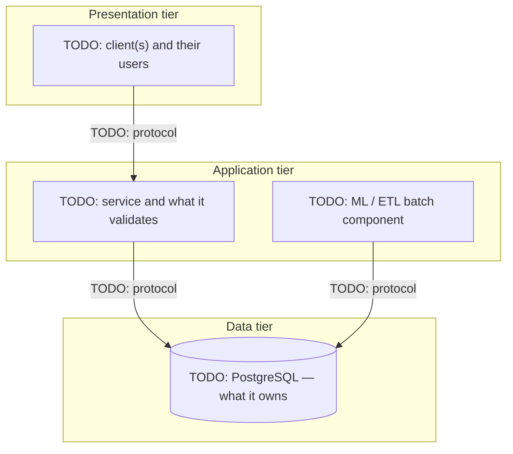

# 03 — Architecture

> **Status:** skeleton. Completed in
> [week 01](../curriculum/week-01-requirements-and-architecture/README.md),
> section 7B. Replace every `TODO:` marker. Keep the section headings: the
> week-01 tests and later weeks reference them.

## 1. Three-tier architecture

Start from
[`../curriculum/week-01-requirements-and-architecture/starter/architecture-diagram.mmd`](../curriculum/week-01-requirements-and-architecture/starter/architecture-diagram.mmd).
Diagrams are committed as source; add an exported image only where a rendered
copy is needed.

TODO: one paragraph naming each tier's single responsibility, and stating the
arrow that deliberately does not exist and why.

## 2. Two-tier versus three-tier

| Criterion | Two-tier | Three-tier | Consequence for MoleculeTrace |
|-----------|----------|-----------|-------------------------------|
| Credentials | TODO: | TODO: | TODO: |
| Location of business rules | TODO: | TODO: | TODO: |
| Concurrent users and connections | TODO: | TODO: | TODO: |
| Cost of replacing the client | TODO: | TODO: | TODO: |
| Adding a batch ML job | TODO: | TODO: | TODO: |
| Build effort in this course | TODO: | TODO: | TODO: |

**Decision:** TODO.
**Rationale, citing requirement IDs:** TODO.
**Strongest counter-argument and the answer to it:** TODO.

## 3. Responsibilities by tier

Owning tier is `Data`, `Application`, `ML` or `Presentation`. Anything that must
be true of the data itself belongs to the data tier, because the database is the
only component every writer passes through.

| Responsibility | Owning tier | Justification |
|----------------|-------------|---------------|
| Uniqueness of a molecule's canonical SMILES | Data | Must hold for every writer, including batch jobs |
| TODO: | TODO: | TODO: |

TODO: at least eight rows, including one where the rule is enforced in two tiers
for different reasons.

## 4. File-system processing versus a DBMS

| # | Dimension | With files | With PostgreSQL | MoleculeTrace example |
|---|-----------|-----------|-----------------|-----------------------|
| 1 | Redundancy and inconsistency | TODO: | TODO: | TODO: |
| 2 | Difficulty accessing data | TODO: | TODO: | TODO: |
| 3 | Data isolation | TODO: | TODO: | TODO: |
| 4 | Integrity | TODO: | TODO: | TODO: |
| 5 | Atomicity | TODO: | TODO: | TODO: |
| 6 | Concurrent access and security | TODO: | TODO: | TODO: |

TODO: one sentence naming what files still do better here, and where the project
keeps using them.

## 5. Data-flow narrative

### 5.1 Ingesting an activity observation

TODO: numbered steps from the source CSV to the dashboard. For each step name
the component, the protocol and the rule enforced there. State where a row with
an unknown molecule is rejected, and by what.

### 5.2 Producing and storing a prediction

TODO: numbered steps from a dataset version through training to a stored
prediction row. Name what makes the result reproducible and which tier owns
that guarantee.

## 6. Levels of abstraction

### 6.1 Physical level

TODO: what lives here in this project, and which weeks touch it.

### 6.2 Logical level

TODO: the tables and relationships, and which weeks design them.

### 6.3 View level

TODO: views, API responses and dashboard panels, and which weeks build them.

### 6.4 Schema versus instance

TODO: one sentence each, with a MoleculeTrace example.

### 6.5 Data independence

- **Physical data independence:** TODO: a change planned for week 17 or 18, and
  what must not change because of it.
- **Logical data independence:** TODO: a logical change and the view that
  protects the clients from it.

## 7. Actors and privileges

TODO: for each actor in `01_problem_statement.md` §5, the tier they enter
through and the privileges they will eventually hold in the database. This table
becomes the `GRANT` plan later in the course.

| Actor | Enters through | Reads | Writes | Administers |
|-------|----------------|-------|--------|-------------|
| TODO: | TODO: | TODO: | TODO: | TODO: |

## 8. Open architectural questions

TODO: questions you cannot answer yet, each with the week that will answer it.

## Related documents

- [`01_problem_statement.md`](01_problem_statement.md) — actors and scope.
- [`02_requirements.md`](02_requirements.md) — the requirements this
  architecture must satisfy.
- [`decisions/`](decisions/) — architecture decision records.
