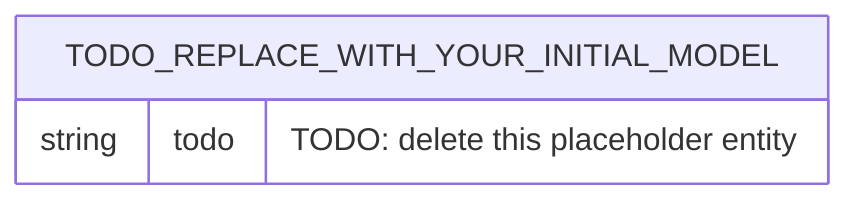
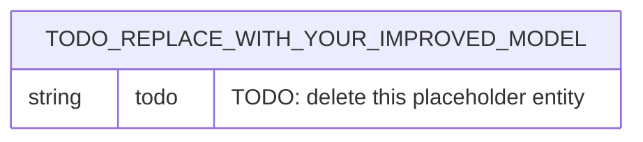

# Data Model — ER and EER Design

> **Status:** skeleton. Completed in
> [week 02](../curriculum/week-02-er-and-eer-design/README.md), sections 6 and
> 7. Replace every `TODO:` marker. Do not delete section headings — the week-02
> tests, week 03's DDL and week 15's dataset versioning depend on them.

> **Educational use only.** All molecular results produced by this project are
> teaching artefacts. They are not scientific findings, not medical advice and
> must not be used for any clinical or drug-development decision. Any data
> generated by the project's own scripts is explicitly labelled *synthetic*.

Scope: exactly the sixteen concepts named in week 02, README section 5.1 —
`UserAccount`, `Role`, `Molecule`, `MoleculeSynonym`, `DescriptorType`,
`MoleculeDescriptor`, `BiologicalTarget`, `Assay`, `ActivityObservation`,
`Dataset`, `DatasetVersion`, `Experiment`, `ModelVersion`, `Prediction`,
`PredictionValidation` and `AuditLog`.

## 1. Concept inventory

One row per concept. The verdict must cite one of the three entity-or-attribute
tests in week 02, README section 5.2.

| Concept | Verdict (entity set / associative entity / relationship set / attribute) | Test that decided it | Note |
|---------|--------------------------------------------------------------------------|----------------------|------|
| UserAccount | TODO: | TODO: | TODO: |
| Role | TODO: | TODO: | TODO: |
| Molecule | TODO: | TODO: | TODO: |
| MoleculeSynonym | TODO: | TODO: | TODO: |
| DescriptorType | TODO: | TODO: | TODO: |
| MoleculeDescriptor | TODO: | TODO: | TODO: |
| BiologicalTarget | TODO: | TODO: | TODO: |
| Assay | TODO: | TODO: | TODO: |
| ActivityObservation | TODO: | TODO: | TODO: |
| Dataset | TODO: | TODO: | TODO: |
| DatasetVersion | TODO: | TODO: | TODO: |
| Experiment | TODO: | TODO: | TODO: |
| ModelVersion | TODO: | TODO: | TODO: |
| Prediction | TODO: | TODO: | TODO: |
| PredictionValidation | TODO: | TODO: | TODO: |
| AuditLog | TODO: | TODO: | TODO: |

## 2. Initial ER model

The first honest attempt, committed before it is improved. Paste the contents of
your completed `curriculum/week-02-er-and-eer-design/starter/er-initial.mmd`
here.

Known defects at this stage (you will repair them in section 4):

1. TODO:
2. TODO:
3. TODO:

## 3. Attribute classification

TODO: paste and complete the table from
`curriculum/week-02-er-and-eer-design/starter/attribute-classification.md`. At
least twenty attributes, including at least two composite, at least two
multivalued and at least two derived.

## 4. Improved EER model

Paste the contents of your completed `starter/eer-improved.mmd` here.

### 4.1 Specialisation and generalisation introduced

TODO: name every specialisation or generalisation, its subclasses, and its two
constraints — disjoint or overlapping, total or partial.

### 4.2 Before and after

At least six concrete differences between section 2 and section 4.

| # | Initial model | Improved model | Defect removed |
|---|---------------|----------------|----------------|
| 1 | TODO: | TODO: | TODO: |
| 2 | TODO: | TODO: | TODO: |
| 3 | TODO: | TODO: | TODO: |
| 4 | TODO: | TODO: | TODO: |
| 5 | TODO: | TODO: | TODO: |
| 6 | TODO: | TODO: | TODO: |

## 5. Cardinality table

TODO: paste and complete the table from `starter/cardinality-table.md`. One row
per relationship in section 4; at least one `1:1`, six `1:N` and two `M:N`.

## 6. Participation constraints

TODO: paste and complete the table from `starter/participation-table.md`. Both
sides stated for every relationship; no blank cells.

## 7. DatasetVersion as a weak entity

TODO: at least 200 words naming the owner entity set, the identifying
relationship, the partial key, the resulting full identifier, the existence
dependency, and what happens to versions when a dataset is deleted. State the
alternative — a globally unique version identifier — and what it would cost.
Week 15 depends on this argument.

## 8. User and role specialisation

TODO: choose specialisation, an M:N `holds` relationship, or both. Name the
subclasses; state disjoint or overlapping and total or partial; explain how an
administrator who is also a curator is represented; cite at least one
requirement ID from `docs/02_requirements.md`.

## 9. Relationship narratives

TODO: paste and complete `starter/relationship-narratives.md`. Every
relationship in section 4, explained in plain language, one sentence per
direction, no `foreign key`, `join`, `table` or `many-to-many` jargon.

## 10. Design-decision log

TODO: paste and complete the table from `starter/design-decision-log.md`. At
least eight `DD-` entries, numbered consecutively from `DD-01`, each naming a
rejected alternative and a consequence for a later week.

| ID | Decision | Alternatives considered | Reason | Consequence for a later week | Requirement |
|----|----------|-------------------------|--------|------------------------------|-------------|
| DD-01 | TODO: | TODO: | TODO: | TODO: | TODO: |

## 11. Assumptions and open questions

TODO: anything you had to assume because no requirement settles it, and the
question you would ask a domain expert. Each assumption that later turns out to
be wrong becomes a change request, not a surprise.
